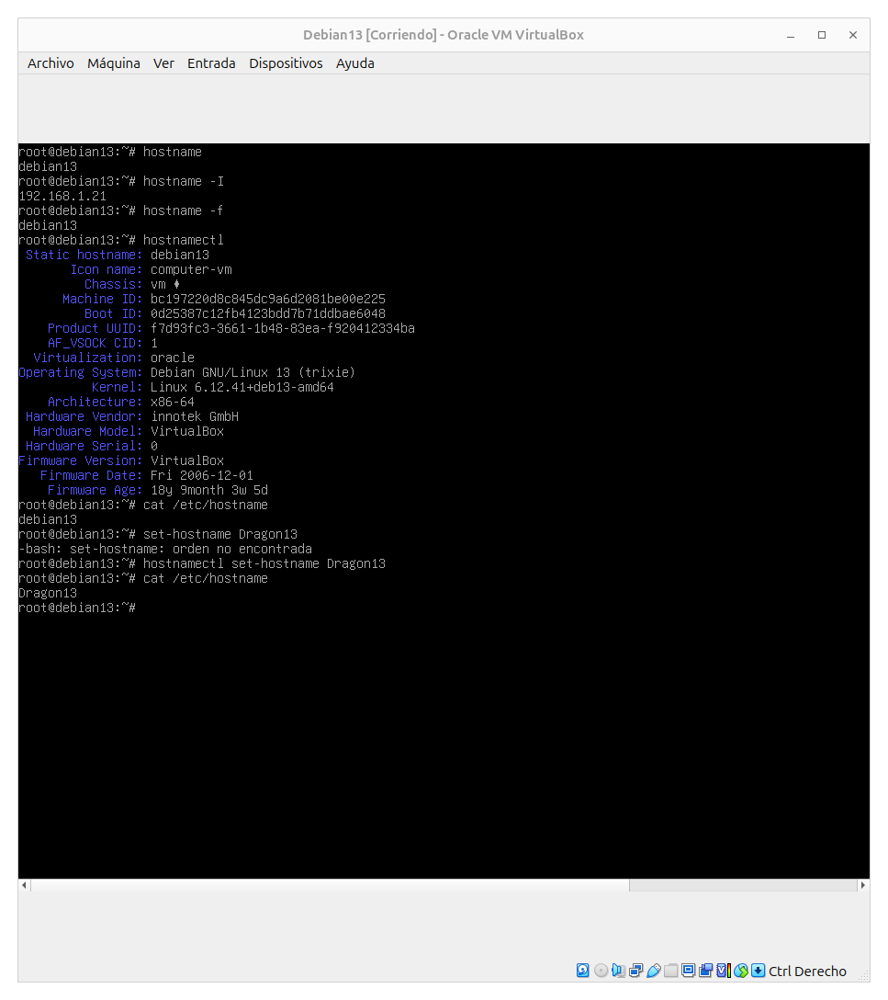

# Linux

## Índice
1. [Conociendo el servidor Linux](#conociendo-el-servidor-linux)  
2. [Autor](#autor)

---

## Conociendo el servidor Linux

En este apartado se mostrarán las capturas de los ejercicios realizados en la terminal Linux, con comentarios explicativos.  
Las imágenes estarán guardadas en la carpeta [`img/`](./img).

### Nombre del host
    

### Version del sistema

---

## Autor

✍️ Iván Palma Sierra

